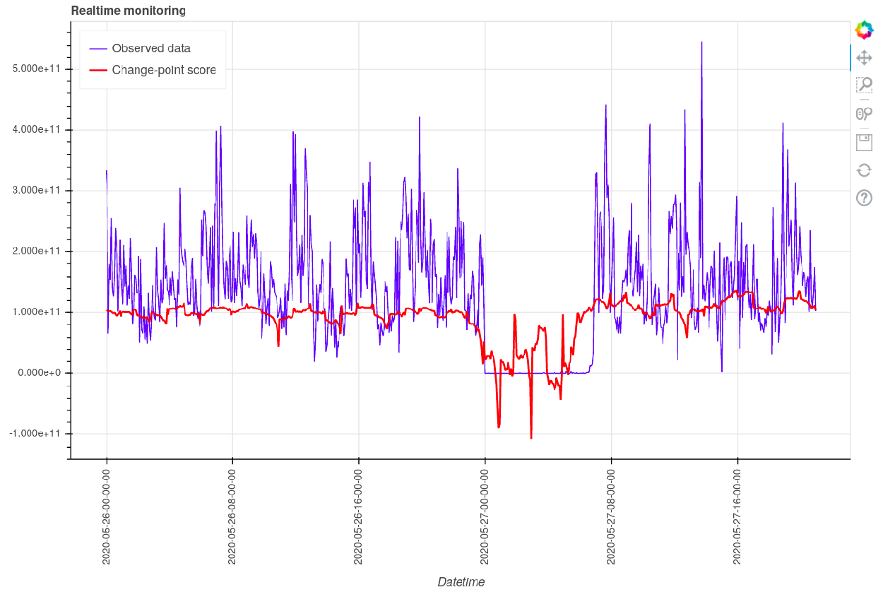

**BlackSwan is a Realtime Streaming Anomaly Detection system that combines several state of the art Deep Anomaly methods with an integrated interface for realtime monitoring.**



- [Realtime Demo](#realtime-demo)
- [Installation](#installation)
- [Usage](#usage)
- [Directory Structure](#directory-structure)
- [Implemented Algorithms](#implemented-algorithms)
- [Credits and Acknowledgements](#credits-and-acknowledgements)


## Realtime Demo


---

## Installation

First, clone the repository to your local machine and switch to the repository folder

```
$ git clone https://github.com/esowc/BlackSwan.git
$ cd BlackSwan
```

###Using pip
```
$ pip install .
```

## Usage

First we process the raw log files into Time Series. An example of processed Time Seires in available in `data/June30_mars_4min_an`.  ## License


```sh
$ python process_logs.py <raw_log_dir>
```

After the processed Time Series have been obtained, the runtime config options can be found in `config.ini`. Logging options can be found in `log_config.ini`. To choose which specific algorithms should be evaluated, edit `model_set.json` which contains several algorithm specific hyperparamers. 

Finally, the system can be started by running `main.py`. Realtime plotting can be started by serving `plot.py` (using bokeh) in a different shell.


```sh
$ python main.py
```

```sh
$ bokeh serve plot.py --port 5006
```

The realtime plots can be found at `http://localhost:5006/plot`. In case the script is being run on a remote machine, a ssh connection can be made to the server by running `ssh -N -L 5006:localhost:5006 <USERNAME>@<MACHINE_IP>` from a local shell. Then the realtime plots can be accessed by the previous url on the local machine.

For more fine-grained control, `main.py` can be edited which is the parent script that is responsible for calling all algorithm implementations.


## Directory Structure

```
blackswan
├── data                            # Processed Data
│   └── June30_mars_4min_an
├── lib                             # Implementations of Algorithms
│   └── DeepADoTS
├── predictions                     # Model Predictions
│   ├── DAGMM
│   ├── ...
│   └── DONUT
├── src                             # Runner Scripts for models
│   └── models
│       ├── DAGMM.py
│       ├── LSTM_DAGMM.py
│       ├── LSTMED.py
│       ├── LSTMAD.py
│       ├── REBM.py
│       └── DONUT.py
├── weights                         # Weights for trained models
│   ├── DAGMM
│   ├── ...
│   └── DONUT
├── config.ini                      # Root config file 
├── current_model_set.json          
├── expt_nbs                        # Experimental notebooks
├── imgs            
├── LICENSE
├── log_config.ini                  # Config file for the logger
├── main.py                         # Root caller for all algorithms 
├── make_config.py
├── model_set.json                  # Model hyperparameters
├── output.log                      # Output log for different runs of main.py
├── plot.py                         # Plotting script
├── process_logs.py                 # Script to process the log files
├── README.md
└── setup.sh                        # Setup script

```

## Implemented Algorithms

- [x] DAGMM 
- [x] LSTM-DAGMM
- [x] Donut
- [x] LSTM-AD
- [x] LSTM-ED
- [x] REBM
- [ ] Banpei
- [ ] N-BEATS
- [ ] ForecastX
- [ ] DeepAR
- [ ] Telemanom 

## Credits and Acknowledgements

This project was funded by [ECMWF](https://www.ecmwf.int/) as part of [ESoWC 2020](https://esowc.ecmwf.int/). 

The following open source libraries were critical in the development of this project
  - [DeepADoTS](https://github.com/KDD-OpenSource/DeepADoTS)
  - [GluonTS](https://gluon-ts.mxnet.io/)
  - [banpei](https://github.com/tsurubee/banpei)
